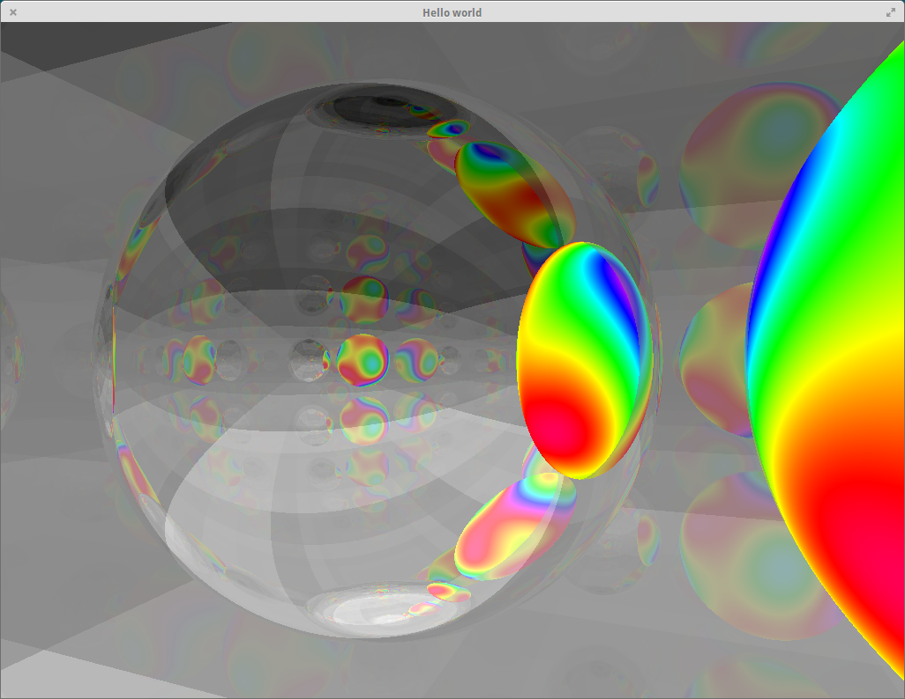
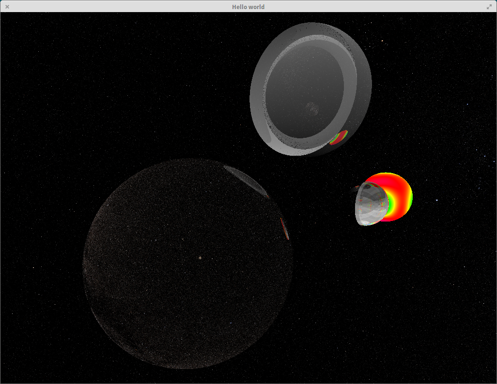
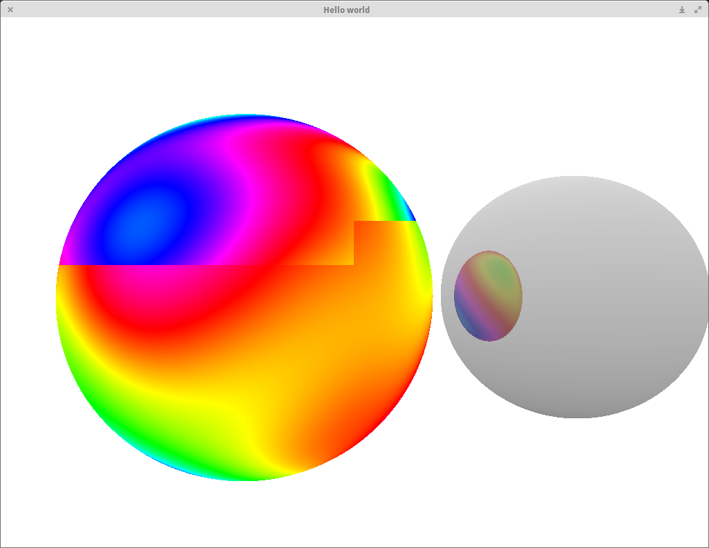
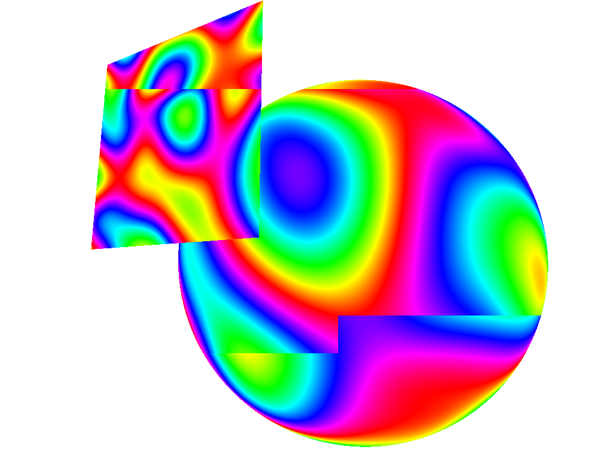

# euclider

A non-euclidean ray tracing prototype written in Rust.

Dual-licensed under [MIT](https://opensource.org/licenses/MIT) or the [UNLICENSE](http://unlicense.org).

# Installation

1. Install the Rust language via [Rustup](https://www.rustup.rs/)
2. Use nightly rust via `rustup default nightly`
3. Clone this repository and `cd` into it
4. Build with `cargo build --release`
5. Run with `target/release/euclider`
6. Open a scene with `target/release/euclider --scene scenes/3d_room.json`

# Controls

* Mouse - camera rotation
* Mouse wheel - resolution adjustment
* [`W`/`A`/`S`/`D`/`Shift`/`Control`] - camera movement
* [`Esc`] - exit

# Preview of version 0.9.0

A reflection chamber.

Universe background and a textured sphere. Thank you NASA for providing the
materials.

# Preview of version 0.5.0

A sphere reflecting another sphere.

# Preview of version 0.4.0

An implementation of a perlin noise HSV surface on a sphere and a test shape.
