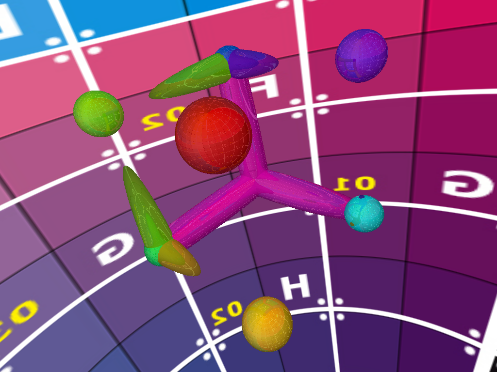

# euclider

A higher-dimensional "non-euclidean" ray tracing prototype written in Rust.

Dual-licensed under [MIT](https://opensource.org/licenses/MIT) or the [UNLICENSE](http://unlicense.org).

# Installation

1. Install the Rust language via [Rustup](https://www.rustup.rs/)
2. Use nightly rust via `rustup default nightly`
3. Clone this repository and `cd` into it
4. Build with `cargo build --release`
5. Run with `target/release/euclider`
6. Open a scene with `target/release/euclider --scene scenes/3d_room.json`

# Controls

* Mouse wheel - resolution adjustment
* [`Esc`] - exit

## 3D Scenes

* Mouse - camera rotation
* [`W`/`A`/`S`/`D`/`Shift`/`Control`] - camera movement

## 4D Scenes

* Generalized rotations happen in a plane, not around an axis. A plane is given by two axes of the camera. Rotate by holding two buttons bound to the following axes and pressing [`C`/`M`]:
  * [`I`] - x axis
  * [`O`] - Y axis
  * [`K`] - Z axis
  * [`L`] - W axis
* [`W`/`A`/`S`/`D`/`Shift`/`Control`/`Q`/`E`] - camera movement

# Preview

A simple sphere displaying Fresnel equations.

A scene containing a room with several entities. Listed from left to right:
* a blue sphere with a partially reflective surface;
* a cuboid with an animated perlin noise surface;
* a glass material in the shape of the complement set operation on a cube and a sphere;
* an infinite cylinder passing through the ceiling and the floor

A non-euclidean 3D scene consisting of hallways that either stretch the space inside (left) or shrink it (right).

A frame of a 4D hypercube made of cylinders as edges. Notice how the rays on the cyan cylinder in the bottom right are reflected to the fourth dimension, revealing more of the frame.
